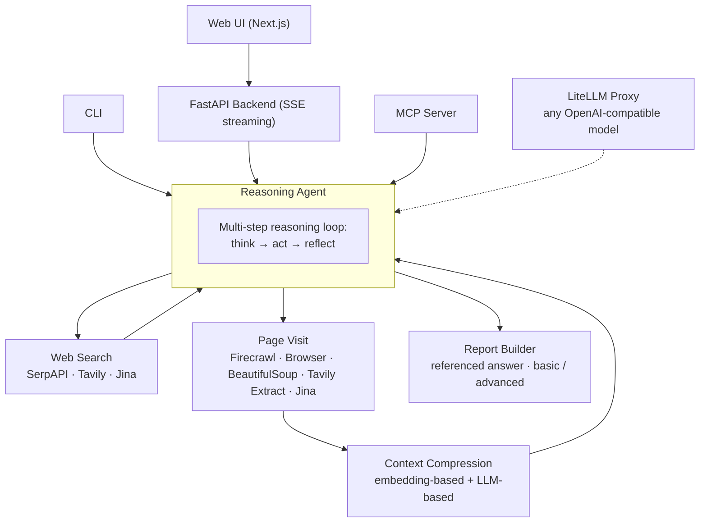

<div align="center">


# II-Researcher

**An open-source deep search agent that browses the web, reasons over what it finds, and writes comprehensive, fully-referenced answers to hard questions.**

[](https://pypi.org/project/ii-researcher/)
[](https://github.com/Intelligent-Internet/ii-researcher/actions/workflows/test.yml)
[](LICENSE)
[](https://www.python.org/)
[](https://github.com/Intelligent-Internet/ii-researcher/stargazers)

[Blog post](https://www.ii.inc/web/blog/post/ii-researcher) ·
[Website](https://ii.inc) ·
[PyPI](https://pypi.org/project/ii-researcher/) ·
[Report a bug](https://github.com/Intelligent-Internet/ii-researcher/issues) ·
[Request a feature](https://github.com/Intelligent-Internet/ii-researcher/issues)

</div>

---

## 📰 News

- **2025-08** — Added a demo of **II-Search-CIR-4B**, our 4B search-reasoning model with Code-Integrated Reasoning. See [`examples/ii_search_4b`](examples/ii_search_4b).
- **2025-06** — II-Researcher scores **84.12%** on Google's [Frames benchmark](https://huggingface.co/datasets/google/frames-benchmark/viewer/default/test) using DeepSeek-R1-0528. [Details below ↓](#-benchmarks)

## 📖 Table of Contents

- [Overview](#-overview)
- [Features](#-features)
- [Benchmarks](#-benchmarks)
- [Demo](#-demo)
- [Architecture](#%EF%B8%8F-architecture)
- [Quick Start](#-quick-start)
- [Usage](#%EF%B8%8F-usage)
  - [CLI](#using-the-cli)
  - [Web Interface](#using-the-web-interface)
  - [MCP (Claude Desktop)](#using-mcp)
  - [Docker](#-run-with-docker)
- [Advanced Configuration](#-advanced-configuration)
- [Contributing](#-contributing)
- [License](#-license)
- [Citation](#-citation)
- [Acknowledgments](#-acknowledgments)

## 🔍 Overview

II-Researcher is a deep search agent built by [Intelligent Internet](https://ii.inc). Given a question, it autonomously searches the web, visits and reads pages, reflects on intermediate findings, and synthesizes a comprehensive final answer with references — the same workflow a human researcher would follow, fully automated.

It ships as a complete, self-hostable stack: a Python library and CLI, a streaming FastAPI backend, a Next.js web UI, and an MCP server that plugs directly into Claude and other MCP-compatible clients.

For the design story and evaluation details, read our [blog post](https://www.ii.inc/web/blog/post/ii-researcher).

## ✨ Features

- 🔍 **Intelligent web search** with pluggable providers (Tavily, SerpAPI, Jina)
- 🕸️ **Web scraping and content extraction** with multiple providers (Firecrawl, Browser, BeautifulSoup, Tavily Extract, Jina), including PDF and YouTube handling
- 🧠 **Multi-step reasoning and reflection** — the agent thinks, acts, and self-corrects until it has enough evidence
- 🗜️ **Context compression** — embedding-based and LLM-based compressors keep long pages within the model's context window
- ⚙️ **Model-agnostic** via LiteLLM — run OpenAI, DeepSeek, Gemini, OpenRouter, or any OpenAI-compatible endpoint (including self-hosted models)
- ⚡ **Fully asynchronous** with token-level streaming end to end (CLI, SSE API, and web UI)
- 📝 **Referenced report generation** with selectable `basic` and `advanced` report types and multilingual support
- 🔌 **MCP server** for one-line integration with Claude Desktop and other MCP clients
- 🧱 **Structured outputs** powered by [BAML](https://github.com/BoundaryML/baml)

## 📊 Benchmarks

We benchmarked II-Researcher on the [Frames dataset](https://huggingface.co/datasets/google/frames-benchmark/viewer/default/test) by Google using the DeepSeek-R1-0528 model, achieving an accuracy of **84.12%**.


## 🎬 Demo

**Web interface:**

https://github.com/user-attachments/assets/d862b900-a06b-46c6-9694-cccd1edac6f6

**MCP integration with Claude:**

https://github.com/user-attachments/assets/2c1542f0-0e1b-44d5-8fc5-0446a07b3821

## 🏗️ Architecture



**How it works:**

1. The **reasoning agent** receives a question and enters a think–act–reflect loop, streaming its reasoning tokens as it goes.
2. At each step it can call tools: **web search** (SerpAPI, Tavily, or Jina) and **page visit** (Firecrawl, headless browser, BeautifulSoup, Tavily Extract, or Jina — with dedicated handling for PDFs and YouTube).
3. Retrieved content passes through **context compression** (embedding similarity filtering, optionally an LLM compressor) so only the most relevant material enters the model's context.
4. When the agent has gathered enough evidence, the **report builder** writes the final answer with references, in `basic` or `advanced` form.
5. All model calls route through a **LiteLLM proxy**, so any OpenAI-compatible model — commercial or self-hosted — can power every stage.

## 🚀 Quick Start

### Requirements

- Python 3.10+ (for local development)
- Docker and Docker Compose (for containerized deployment)
- Node.js and npm (for local frontend development)

### 1. Install

**From PyPI:**

```bash
pip install ii-researcher
```

**Or from source:**

```bash
git clone https://github.com/Intelligent-Internet/ii-researcher.git
cd ii-researcher
pip install -e .
```

### 2. Set your environment variables

```bash
# API Keys
export OPENAI_API_KEY="your-openai-api-key"
export TAVILY_API_KEY="your-tavily-api-key"       # required when SEARCH_PROVIDER=tavily
export SERPAPI_API_KEY="your-serpapi-api-key"     # required when SEARCH_PROVIDER=serpapi
export FIRECRAWL_API_KEY="your-firecrawl-api-key" # required when SCRAPER_PROVIDER=firecrawl

# API Endpoints
export OPENAI_BASE_URL="http://localhost:4000"

# Search and scraping providers
export SEARCH_PROVIDER="serpapi"    # Options: 'serpapi' | 'tavily' | 'jina'
export SCRAPER_PROVIDER="firecrawl" # Options: 'firecrawl' | 'bs' | 'browser' | 'tavily_extract' | 'jina'

# Context compression
export COMPRESS_EMBEDDING_MODEL="text-embedding-3-large"
export COMPRESS_SIMILARITY_THRESHOLD="0.3"
export COMPRESS_MAX_OUTPUT_WORDS="4096"
export COMPRESS_MAX_INPUT_WORDS="32000"

# Timeouts and performance
export SEARCH_PROCESS_TIMEOUT="300" # seconds
export SEARCH_QUERY_TIMEOUT="20"    # seconds
export SCRAPE_URL_TIMEOUT="30"      # seconds
export STEP_SLEEP="100"             # milliseconds

# Reasoning models
export R_MODEL=r1                # model used for reasoning
export R_TEMPERATURE=0.2         # temperature for the reasoning model
export R_REPORT_MODEL=gpt-4o     # model used for writing the final report
export R_PRESENCE_PENALTY=0      # presence_penalty for the reasoning model
```

Optional — LLM-based context compression (better compression quality):

```bash
export USE_LLM_COMPRESSOR="TRUE"
export FAST_LLM="gemini-lite" # model used for context compression
```

### 3. Start the LiteLLM proxy

```bash
pip install litellm
```

Create `litellm_config.yaml`:

```yaml
model_list:
  - model_name: text-embedding-3-large
    litellm_params:
      model: text-embedding-3-large
      api_key: os.environ/OPENAI_API_KEY
  - model_name: gpt-4o
    litellm_params:
      model: gpt-4o
      api_key: os.environ/OPENAI_API_KEY
  - model_name: r1
    litellm_params:
      model: deepseek-reasoner
      api_base: https://api.deepseek.com/beta
      api_key: os.environ/DEEPSEEK_API_KEY

litellm_settings:
  drop_params: true
```

Then start the server (defaults to `http://localhost:4000`):

```bash
litellm --config litellm_config.yaml
```

<details>
<summary><b>Alternative: route models through OpenRouter</b></summary>

```yaml
model_list:
  - model_name: text-embedding-3-large
    litellm_params:
      model: text-embedding-3-large
      api_key: os.environ/OPENAI_API_KEY
  - model_name: gpt-4o
    litellm_params:
      model: openai/chatgpt-4o-latest
      api_base: https://openrouter.ai/api/v1
      api_key: your_openrouter_api_key_here
  - model_name: r1
    litellm_params:
      model: deepseek/deepseek-r1
      api_base: https://openrouter.ai/api/v1
      api_key: your_openrouter_api_key_here
  - model_name: gemini-lite
    litellm_params:
      model: gemini/gemini-2.5-pro-preview-03-25
      api_base: https://openrouter.ai/api/v1
      api_key: your_openrouter_api_key_here

litellm_settings:
  drop_params: true
```

</details>

### 4. Ask your first question

```bash
python ii_researcher/cli.py --question "your question here" --stream
```

## 🖥️ Usage

### Using the CLI

```bash
python ii_researcher/cli.py --question "your question here" --stream
```

Useful flags:

| Flag | Description | Default |
|------|-------------|---------|
| `--question` | The question to research (required) | — |
| `--stream` | Stream reasoning and the answer token by token | off |
| `--report-type` | Final report style: `basic` or `advanced` | `basic` |
| `--save-report` | Save the result to a markdown file | off |

### Using the Web Interface

1. Start the backend API:

```bash
python api.py
```

The API server runs on `http://localhost:8000` and exposes an SSE endpoint (`/search`) that streams every step of the research process.

2. Configure the frontend — create `frontend/.env`:

```
NEXT_PUBLIC_API_URL=http://localhost:8000
```

3. Install and run the frontend:

```bash
cd frontend
npm install
npm run dev
```

The web UI is now available at `http://localhost:3000`.

### Using MCP

Connect II-Researcher to Claude Desktop (or any MCP client) as a research tool:

1. Set up your environment file:

```bash
cp .env.example .env
# Edit .env and add your API keys
```

2. Install the MCP server into Claude:

```bash
mcp install mcp/server.py -f .env
```

3. Restart your Claude App. See [Claude Desktop Integration](https://docs.gptr.dev/docs/gpt-researcher/mcp-server/claude-integration) for a walkthrough of the integration flow.

### 🐳 Run with Docker

Make sure your environment variables are set (step 2 of Quick Start), then:

```bash
docker compose up --build -d
```

This starts three services:

| Service | Description | URL |
|---------|-------------|-----|
| `frontend` | Next.js web UI | http://localhost:3000 |
| `api` | FastAPI backend (SSE streaming) | http://localhost:8000 |
| `litellm` | LiteLLM proxy server | http://localhost:4000 |

```bash
# View logs
docker compose logs -f            # all services
docker compose logs -f api        # a single service

# Stop everything
docker compose down
```

## 🔧 Advanced Configuration

<details>
<summary><b>Serve a self-hosted reasoning model with SGLang</b></summary>

To run the Qwen/QwQ-32B model using SGLang as the reasoning backend:

```bash
python3 -m sglang.launch_server --model-path Qwen/QwQ-32B --host 0.0.0.0 --port 30000 --tp 8 --context-length 131072
```

Point `OPENAI_BASE_URL` (or your LiteLLM config) at the SGLang endpoint.

</details>

<details>
<summary><b>Legacy pipeline mode</b></summary>

The legacy pipeline mode is still available in the [`legacy/ii_researcher_pipeline`](https://github.com/Intelligent-Internet/ii-researcher/tree/legacy/ii_researcher_pipeline) branch but is no longer recommended.

Pipeline-mode model configuration:

```bash
export STRATEGIC_LLM="gpt-4o" # model used to choose the next action
export SMART_LLM="gpt-4o"     # model used for other pipeline tasks
```

</details>

## 🤝 Contributing

We welcome contributions of all kinds — bug reports, feature requests, documentation, and code. Please read our [Contributing Guide](CONTRIBUTING.md) to get started, and see our [Code of Conduct](CODE_OF_CONDUCT.md) and [Security Policy](SECURITY.md).

## 📄 License

II-Researcher is released under the [Apache License 2.0](LICENSE).

## 📚 Citation

If you use II-Researcher in your research, please cite:

```bibtex
@misc{ii-researcher2025,
  title        = {II-Researcher: An Open-Source Deep Search Agent},
  author       = {Intelligent Internet},
  year         = {2025},
  howpublished = {\url{https://github.com/Intelligent-Internet/ii-researcher}}
}
```

## 💡 Acknowledgments

II-Researcher is inspired by and built with the support of the open-source community:

- **[LiteLLM](https://www.litellm.ai/)** — efficient AI model integration
- **[node-DeepResearch](https://github.com/jina-ai/node-DeepResearch)** — prompt inspiration
- **[gpt-researcher](https://github.com/assafelovic/gpt-researcher)** — prompt inspiration, web scraper tool
- **[BAML](https://github.com/BoundaryML/baml)** — structured outputs

## ⭐ Star History

[](https://star-history.com/#Intelligent-Internet/ii-researcher&Date)
